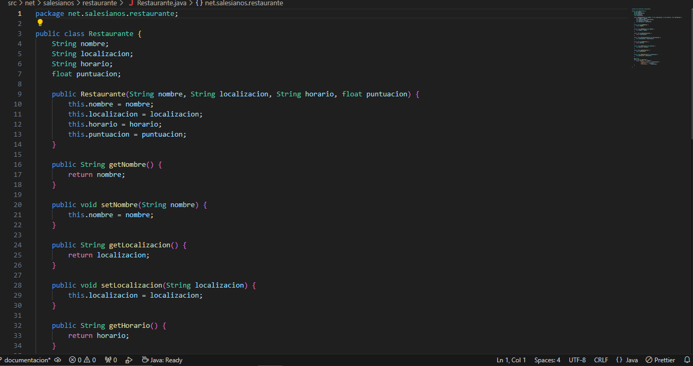
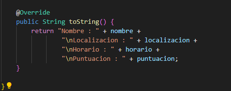
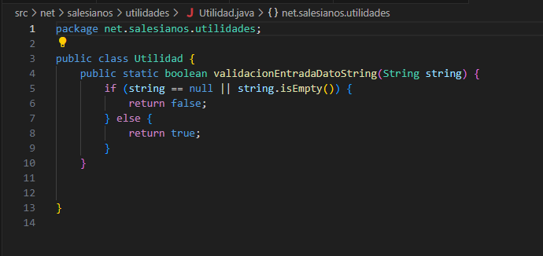
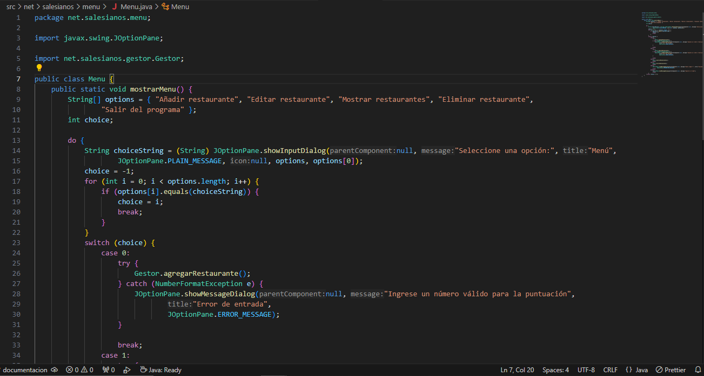
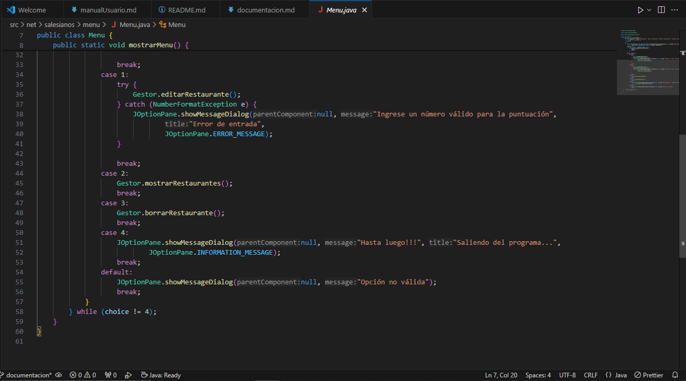
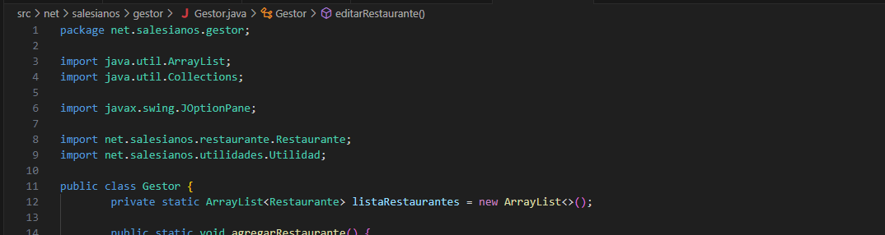
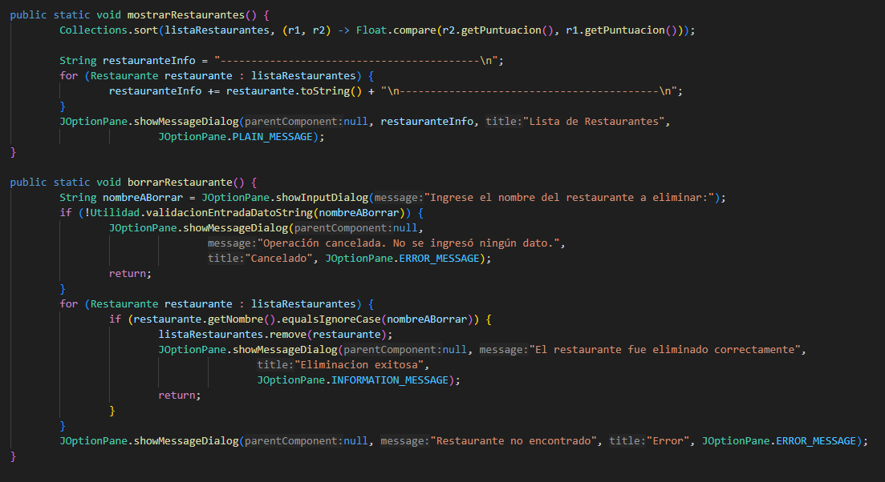
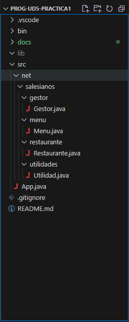

La clase restaurante tendra sus atributos, constructor y metodos de acceso y un to string al final

------------------------------------------------------------------------------o

en la clase utilidad tendremos un metodo para validar que se hayan ingresado datos, retornara true o false 

------------------------------------------------------------------------------o

En la clase menu tendremos un array con las opciones de nuestro menu, se usara un do while para tener el menu en bucle y un switch para poder seleccionar la opcion que queramos, en el caso 0 lo usaremos para agregar restauranes con el metodo estatico de Gestor, tambien capturara las exepciones de numberformat para eviar que se pongan letras en los campos que se supone reciben valores numericos.

el caso 1 nos servira para editar restaurantes y tambien atrapara exepciones para puntuacion. el caso 2 mosrara la lista de restaurantes que hayamos agregado antes, el caso 3 nos permitira borrar un restaurante y el caso 4 nos dejara finalizar el programa, por ultimo el default nos ayudara para cuando se ingrese un valor invalido para opcion nos lo muestre.

------------------------------------------------------------------------------o

el metodo gestor tendra como atributo un array list,

tambien tiene diferentes metodos como agregar restaurante que nos preguntara por la informacion del restaurante la cual mas adelante nos servira para esablecer los valores 

 

 tiene un validor para la puntuacion y crea y agrega el restaurante al array list, nos informa con un mensaje.

  

 el metodo editar nos preguntara por el nombre del restaurante que queramos editar y si lo encuentra nos mostrara un menu en el que podremos editar informacion especifica o todo si a asi lo precisamos en nuesta eleccion.

 

 por ultimo establece los nuevos valores y nos muestra por pantalla si hay errores o todo salio bien

el metodo de mostrar restaurante imprimira por pantalla todos los restaurantes que hayamos agregado al array list y por ultimo
el metodo de borrar  nos preguntara por el nombre del restaurante que queramos borrar y lo eliminara del array list y nos mostrara por pantalla el estado, 

------------------------------------------------------------------------------o

la paquetacion sera la siguiente:
 
