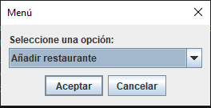
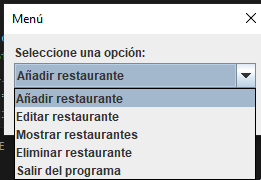
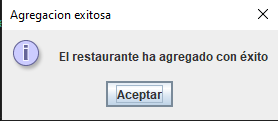
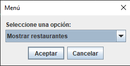
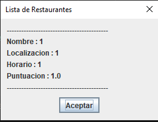
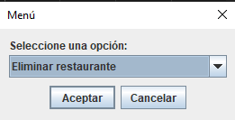
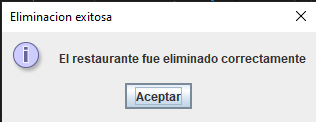
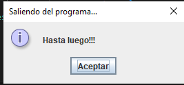

Al momento de iniciar el programa se nos mostrara un menu como el siguiente :  

cuando lo clickeemos se desplegara el menu con las siguientes opciones :  

           
Cuando seleccionemos añadir restaurante lo primero que nos pedira sera el nombre del restaurante que queremos añadir  : 

Luego la localizacion  :

Luego el horario :

y por ultimo la puntuacion del restaurante que tendra que ser un valor numerico :

en caso que no se ingrese un valor numerico nos saldra el siguiente error : 

y en caso que no ingresemos ningun valor en los anteriores campos nos aparecera el siguiente error :

si todos los datos fueron ingresados de manera correcto ya tendremos nuestro restaurante agregado y nos mostrara el siguiente mensaje :  

Cuando hayamos agreado el restaurante volveremos al menu 

 

Si seleccionamos editar restaurante lo primero que nos preguntara es por el nombre del restaurante que queremos editar : 

cuando lo ingresemos se nos mosrara otro menu  saber que queremos editar  y en base a lo que seleccionemos repetiremos un proceso similar al de agregar restaurante:

una vez agregado nos mostrara el siguiente mensaje : 

cuando le demos aceptar volveremos al menu  :

 

Si seleccionamos mostrar restaurantes nos saldra uan lista en la que podremos ver los restaurantes que hemos agregado :

Cuando veamos la lista y le demos aceptar volveremos al menu

al seleccionar eliminar nos preguntara por el nombre del restaurante a eliminar :

una vez eliminado nos saldra el siguiente mensaje :

por ultimo al darle al salir del programa nos mostrara el siguiente mensaje :

y cuando le demos aceptar el programa finalizara

[Volver](/README.md)
